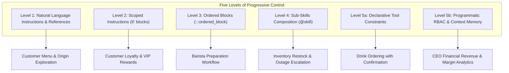

# Artisan Roast — Technical Notes & Mantle Architecture Guide

This document captures architectural decisions, implementation patterns, and notes on how **Artisan Roast Coffee Co.** leverages the **Five Levels of Progressive Control** in the **Rasa Mantle Orchestrator**.

---

## 1. Rasa Mantle Progressive Control Architecture

Rasa Mantle allows developers to balance LLM creativity with deterministic enterprise control using a five-level hierarchy:



### Level 1: Natural Language Instructions & Semantic Retrieval
- **Skill**: `skills/browse_coffee_menu/skill.md`
- **Reference Doc**: `references/roast_origins_guide.md`
- **Pattern**: Unconstrained natural language guidance combined with local vector embeddings (`sentence-transformers/all-MiniLM-L6-v2`) in `integrations.yml`. The LLM dynamically retrieves tasting notes, allergen policies, and origin details without rigid state machines.

### Level 2: Scoped Instructions (`if:` blocks)
- **Skill**: `skills/check_loyalty_rewards/skill.md`
- **Pattern**: Uses Mantle compile-time prose markers (`if: session.project.loyalty_tier == "Gold"`, `if: session.project.loyalty_points >= 50`).
- **Why it matters**: Conditional instructions are only visible to the LLM when the condition evaluates to true, preventing context bloat and hallucinated perks for lower-tier members.

### Level 3: Ordered Blocks (`:::ordered_block`)
- **Skill**: `skills/process_store_orders/skill.md`
- **Pattern**: `:::ordered_block id=barista_fulfillment_flow` enforcing strict procedural execution:
  1. `fetch_queue` (`execute_tool: fetch_store_order_queue`)
  2. `select_order` (autonomous step with `complete_when`)
  3. `verify_recipe` (verifies milk choice and custom notes)
  4. `start_brewing` (updates status to 'brewing')
  5. `mark_ready_for_pickup` (dispatches customer notification)
- **Why it matters**: Baristas must follow standard operational recipes and safety verification before marking drinks as ready.

### Level 4: Sub-Skills Composition
- **Skills**: `skills/manage_store_inventory/` delegating to `@skill.restock_inventory` and `@skill.escalate_supply_outage`.
- **Pattern**: Modular decomposition. The parent inventory skill evaluates stock levels and invokes specialized child skills for delivery intake or emergency regional alerting.

### Level 5a: Declarative Tool Constraints & Preconditions
- **Skill**: `skills/place_customer_order/skill.md`
- **Pattern**:
  ```yaml
  tool_constraints:
    - place_coffee_order:
        requires: session.place_customer_order.selected_item
        requires_confirmation:
          enabled: true
          utter_for_confirmation: utter_confirm_coffee_order
          utter_on_user_denial: utter_coffee_order_cancelled
        on_success: utter_coffee_order_success
  ```
- **Why it matters**: Zero chance of placing an unintended financial transaction. Mantle deterministically pauses the dialogue, prompts the user for explicit confirmation, and branches accordingly.

### Level 5b: Programmatic RBAC & Context Memory
- **Skills**: `skills/query_executive_analytics/` and `skills/verify_ceo_authentication/`
- **Decorator**: `@require_role("ceo")` in `tools/coffeeshop.py`
- **Pattern**: When an unauthenticated user asks for sensitive financial metrics, the tool intercepts execution and returns `auth_required: True`. The agent prompts for the 4-digit PIN (`8888`), calls `verify_ceo_pin` (which sets `context.memory.set("is_ceo", True)`), and seamlessly re-executes the analytics query.

---

## 2. macOS SSL Certificate Handling

On macOS, Python's default certificate bundle can fail to resolve local CAs. We resolve this in the `Makefile` by dynamically exporting `SSL_CERT_FILE` from Mozilla's trusted CA bundle via `certifi`:
```bash
export SSL_CERT_FILE=$(python -c "import certifi; print(certifi.where())" 2>/dev/null)
```

---

## 3. Synthetic Datasets & Domain Schema

The project augments the 149,116 transaction ledger with three realistic domain tables:
1. `customers`: 100 profiles with loyalty tiers (Regular, Silver, Gold), points balance, and favorite drinks.
2. `raw_materials` & `product_recipes`: Bill-of-Materials mapping unit costs (beans, milk, cups, syrups) to calculate exact Cost of Goods Sold (COGS) and profit margins ($569k gross profit across 149k sales).
3. `store_inventory`: Real-time stock counts across Astoria (#3), Lower Manhattan (#5), and Hell's Kitchen (#8).
