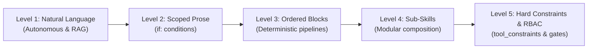
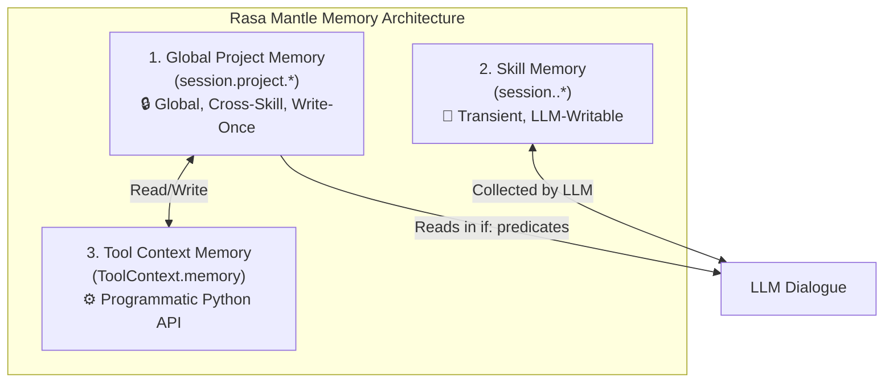

# Artisan Roast — Reference Architecture for Rasa Mantle

```text
Author:        Samrudha Kelkar
Wave:          wave-01-mantle
Assessed on:   2026-09-05
Assessed by:   Samrudha Kelkar
Verified with: rasa-pro 3.20.0.dev6, Python 3.12, uv
```

> **For Rasa Practitioners & Architects:**  
> This repository is an educational blueprint demonstrating how to build a production-grade enterprise conversational agent on the **Rasa Mantle** engine. Rather than relying on monolithic prompts or rigid flowcharts, this project showcases how Mantle's **Five Levels of Progressive Control**, **Typed Session Memory**, and **Declarative Tool Constraints** orchestrate complex multi-persona workflows with deterministic reliability.

---

## 1. Architectural Philosophy: The Mantle Shift

Traditional conversational architectures force teams to choose between two extremes:
1. **Unpredictable Autonomy**: Handing raw tools to an open-ended LLM with large system prompts, leading to hallucinated arguments, runaway steps, and prompt drift.
2. **Rigid Flowcharts**: Hardcoding every conversation turn into brittle directed graphs that break as soon as a user deviates, interrupts, or asks a clarifying question.

**Rasa Mantle solves this by introducing Progressive Control**: a spectrum where developers choose the exact level of autonomy required for each step of a business process. This reference project implements all five levels side-by-side:



---

## 2. Implementing the Five Levels of Progressive Control

| Level | Mantle Feature | Architectural Purpose | Reference Implementation |
| :--- | :--- | :--- | :--- |
| **Level 1** | **Natural Language & References** | Autonomous semantic exploration grounded by local vector embeddings (`sentence-transformers/all-MiniLM-L6-v2`) over domain guides without writing custom code. | [`skills/coffee_faq/`](skills/coffee_faq/)<br>[`skills/browse_coffee_menu/`](skills/browse_coffee_menu/) |
| **Level 2** | **Scoped Instructions (`if:` blocks)** | Compile-time conditional instruction blocks that activate strictly when session memory matches predicates, preventing context clutter. | [`skills/check_loyalty_rewards/skill.md`](skills/check_loyalty_rewards/skill.md) |
| **Level 3** | **Ordered Blocks (`:::ordered_block`)** | Deterministic procedural execution enforcing ordered multi-step completion guards (`complete_when`) while allowing natural clarification within each step. | [`skills/process_store_orders/skill.md`](skills/process_store_orders/skill.md) |
| **Level 4** | **Sub-Skill Composition (`@skill.<name>`)** | High-level orchestrator delegating tasks to isolated, reusable specialist sub-skills rather than building monolithic workflows. | [`skills/manage_store_inventory/`](skills/manage_store_inventory/)<br>[`skills/restock_inventory/`](skills/restock_inventory/) |
| **Level 5a** | **Declarative Tool Constraints** | Hard engine-level preconditions (`requires: session.place_customer_order.selected_item`) and mandatory verification steps (`requires_confirmation: enabled: true`). | [`skills/place_customer_order/skill.md`](skills/place_customer_order/skill.md) |
| **Level 5b** | **Programmatic RBAC via Context** | Security boundary where Python decorators inspect `ToolContext.memory` to block unauthorized access to sensitive tools unless unlocked via PIN authentication. | [`skills/query_executive_analytics/`](skills/query_executive_analytics/)<br>[`skills/verify_ceo_authentication/`](skills/verify_ceo_authentication/)<br>[`tools/coffeeshop.py`](tools/coffeeshop.py) |

---

## 3. Deep-Dive: Key Architectural Patterns

### Pattern A: Scoped Instructions for Dynamic Persona Rules (Level 2)
In Mantle, you do not write giant `if/else` logic in code for conversational variations. Using scoped prose markers, the engine dynamically injects rules only when the session memory satisfies the predicate:

```markdown
<!-- skills/check_loyalty_rewards/skill.md -->
Once their profile is retrieved, announce their current points balance and tier status.

if: session.project.loyalty_tier == "Gold"
Welcome them warmly as a Gold VIP member. Mention that they receive double points on specialty roasts and complimentary flavor shots on all barista beverages.

if: session.project.loyalty_points >= 50
Congratulate the customer on earning enough rewards for a free handcrafted drink (50 points). Ask if they would like to redeem 50 points now.
```

### Pattern B: Deterministic Procedural Pipelines (Level 3)
When an enterprise process must follow exact compliance steps (e.g. Barista order fulfillment or banking transactions), Mantle's `:::ordered_block` provides linear guarantees without losing conversational fluidity:

```yaml
<!-- skills/process_store_orders/skill.md -->
:::ordered_block id=barista_fulfillment_flow
steps:
  - id: fetch_queue
    execute_tool: fetch_store_order_queue
  - id: select_order
    instructions: |
      Present open orders. Ask which order they want to prepare, and record the Order ID in selected_order_id.
    complete_when: session.process_store_orders.selected_order_id
  - id: verify_recipe
    instructions: |
      Verify drink specifications. Confirm with the barista and set recipe_verified to true.
    complete_when: session.process_store_orders.recipe_verified == True
  - id: start_brewing
    instructions: |
      Instruct the barista to start brewing. When they confirm, set brewing_confirmed to true.
    complete_when: session.process_store_orders.brewing_confirmed == True
  - id: mark_ready_for_pickup
    instructions: |
      Call @tool.update_order_pickup_status with status 'ready'. Set pickup_notified to true.
    complete_when: session.process_store_orders.pickup_notified == True
:::
```

### Pattern C: Modular Sub-Skill Delegation (Level 4)
Rather than overloading a single inventory skill with edge cases, `manage_store_inventory` acts as an orchestrator, dispatching to `@skill.restock_inventory` or `@skill.escalate_supply_outage`:

```markdown
<!-- skills/manage_store_inventory/skill.md -->
If inventory levels are adequate, summarize stock status clearly.

If stock is low or the operator receives incoming supplies:
Transfer execution to @skill.restock_inventory to handle delivery logging and stock updates.

If critical ingredients are completely depleted:
Transfer execution to @skill.escalate_supply_outage to trigger immediate supply notifications.
```

### Pattern D: Declarative Constraints & Confirmation Gates (Level 5a)
Mantle enforces tool requirements declaratively in YAML. The LLM cannot trigger `place_coffee_order` without memory holding the selected item, and the engine automatically triggers `utter_confirm_coffee_order` before tool execution:

```yaml
<!-- skills/place_customer_order/skill.md -->
tool_constraints:
  - place_coffee_order:
      requires: session.place_customer_order.selected_item
      requires_confirmation:
        enabled: true
        utter_for_confirmation: utter_confirm_coffee_order
      on_success: utter_coffee_order_success
```

### Pattern E: Tool-Level RBAC & Context Memory (Level 5b)
To protect sensitive enterprise operations (e.g. CEO analytics over 149k financial rows), tools inspect `ToolContext.memory` directly. Project memory is write-once and cannot be hallucinated by the LLM:

```python
# tools/coffeeshop.py
def require_role(required_role: str):
    def decorator(func):
        @functools.wraps(func)
        async def wrapper(*args, context: ToolContext = None, **kwargs):
            is_ceo = bool(context and context.memory.get("is_ceo"))
            if required_role == "ceo" and not is_ceo:
                return ToolResult(
                    llm_response={
                        "ok": False,
                        "auth_required": True,
                        "message": "Access restricted: Executive CEO authorization required. Prompt user for 4-digit PIN.",
                    }
                )
            return await func(*args, context=context, **kwargs)
        return wrapper
    return decorator
```

---

## 4. Rasa Mantle Memory Architecture & Scopes

Rasa Mantle defines three distinct memory scopes with strict security boundaries:



### Memory Scopes & Governance Rules

| Memory Type | Scope | LLM Writable? | Purpose & Governance in Artisan Roast |
| :--- | :--- | :--- | :--- |
| **Global Project Memory**<br>`session.project.*` | Global (across all skills) | **NO ❌** *(Tool/Seed Only)* | Declared in `memory.yml`. Holds security roles (`is_ceo`), customer profile (`loyalty_tier`, `loyalty_points`), active orders (`active_order_id`), and expressed mood state (`user_mood`). Project memory is **Write-Once** and cannot be mutated or hallucinated directly by LLM prose instructions. |
| **Skill-Scoped Memory**<br>`session.<skill_id>.*` | Local (lifecycle of active skill) | **YES ✅** *(Collected by LLM)* | Transient variables bound to the lifecycle of a specific skill. Used for slot collection (`pin_attempt`), item selection (`place_customer_order.selected_item`), and procedural step completion flags (`recipe_verified`). |
| **Tool Context Memory**<br>`ToolContext.memory` | Python Runtime (`@tool`) | **N/A** *(Python API)* | Programmatic Python API provided to `@tool` functions (`context.memory.get("is_ceo")` and `context.memory.set("is_ceo", True)`). Allows backend tools to inspect or mutate project memory securely after validation. |

---

## 5. Multi-Persona Isolation in a Unified Model

A common challenge in conversational AI is preventing persona cross-talk (e.g. a customer accidentally accessing operator queues, or a barista receiving CEO revenue statistics).

This architecture demonstrates **clean role separation**:
1. **Customer**: Natural language discovery, sensory vector beverage recommendations, scoped tier rewards, declarative ordering.
2. **Operator**: Procedural barista queue fulfillment, sub-skill inventory management.
3. **CEO**: PIN challenge flow (`skills/verify_ceo_authentication`) writing `is_ceo=True` to session memory, unlocking financial and gross-margin analytics.

---

## 6. Setup & How to Run the Code

### Prerequisites
* **Python 3.12**
* **`uv` Package Manager** (`curl -LsSf https://astral.sh/uv/install.sh | sh`)
* **Rasa Pro License Key** (`RASA_LICENSE`)
* **Google Gemini API Key** (`GEMINI_API_KEY`)

---

### Step-by-Step Setup Guide

#### 1. Install Dependencies
```bash
make install
```

#### 2. Configure Environment Variables
```bash
make env
```
Edit `.env` and fill in your credentials:
```bash
RASA_LICENSE=your_rasa_pro_license_key
GEMINI_API_KEY=your_gemini_api_key
```

#### 3. Seed SQLite Database & Datasets
```bash
make reset-db
```
*Synthesizes 100 customer profiles, raw material costs, store inventory, and populates `data/coffeeshop.db`.*

#### 4. Run Pre-Flight Diagnostics & Validation
```bash
make verify
make validate
```

#### 5. Train & Package the Agent Model
```bash
make train
```
*Compiles skill catalog, indexes local embeddings, and packages the model archive in `models/`.*

---

### Running the Application

#### A. Launch the Modern Coffee Shop Web Interface
Start the local HTTP web server:
```bash
python3 -m http.server 8080 --directory web
```
Open your browser to: **`http://localhost:8080`**
*Features AI Sommelier chat, interactive mood chips, 384-dimensional vector match meters, voice speech synthesis, barista queue, and CEO PIN challenge modal.*

#### B. Launch the Voice & Text Inspector
Talk directly to Artisan Roast via terminal microphone or chat:
```bash
make inspect
```

#### C. Run the Production API Server
```bash
make run
```

---

## 7. Repository Layout

```text
coffee-shop/
├── agent.yml                  # Root agent persona, instructions, and reference indexing
├── memory.yml                 # Typed global project memory schema (session.project.*)
├── integrations.yml           # Gemini 2.5 Flash, embeddings, and voice provider configuration
├── endpoints.yml              # NLG rephraser endpoint configuration
├── responses.yml              # Utterances (greetings, confirmations, error states)
├── pyproject.toml             # Pinned dependencies (rasa-pro 3.20.0.dev6) + required-secrets
├── uv.lock                    # Committed deterministic lockfile
├── Makefile                   # Verification, testing, training, and database commands
├── lib/                       # SQLite data layer & importer (149k ledger + synthetic tables)
├── tools/                     # 17 Mantle tools with @tool decorator and RBAC security
├── web/                       # Modern dark espresso Web UI (AI Sommelier & Multi-Persona)
│   ├── index.html             # Web UI HTML layout
│   ├── style.css              # Glassmorphic dark espresso CSS theme
│   ├── app.js                 # Sommelier vector matcher & interactive web logic
│   └── images/                # Generated hero & product imagery
├── skills/                    # 12 Modular skills implementing Progressive Control
│   ├── browse_coffee_menu/    # Level 1: Natural Language menu lookup
│   ├── coffee_faq/            # Level 1: Semantic embeddings retrieval with references/
│   ├── recommend_coffee_sommelier/# Level 1+4: 384-dim sensory vector matching
│   ├── check_loyalty_rewards/ # Level 2: Scoped instructions with if: predicates
│   ├── process_store_orders/  # Level 3: Ordered block for drink preparation
│   ├── manage_store_inventory/# Level 4: Orchestrator delegating to sub-skills
│   ├── restock_inventory/     # Level 4: Sub-skill for shipment intake
│   ├── escalate_supply_outage/# Level 4: Sub-skill for critical stock alerts
│   ├── place_customer_order/  # Level 5a: Tool constraints & confirmation gate
│   ├── verify_ceo_authentication/# Level 5b: PIN authentication flow
│   ├── query_executive_analytics/# Level 5b: RBAC-gated financial intelligence
│   └── goodbye/               # Clean session termination
└── tests/                     # Multi-tier testing suite
    ├── e2e/test_deterministic.yml  # Deterministic tracker assertions across all personas
    ├── e2e/test_judge_faq.yml      # LLM-as-a-judge groundedness & relevance evaluation
    └── dialogue_understanding/     # DU command extraction unit tests
```

---

## 8. Testing & Evaluation Suite

In Mantle, testing moves beyond subjective prompt evaluation into verifiable assertions:

```bash
# 1. Deterministic E2E Tracker Assertions
# Validates flow triggers across customer, operator, sommelier, and CEO queries + smalltalk restraint
make test-e2e

# 2. Dialogue Understanding (DU) Command Generator Tests
make test-du

# 3. LLM-as-a-Judge Evaluation
# Measures Groundedness (fabrication check) and Relevance (topic drift check)
make test-judge

# 4. Run All Evaluation Instruments
make test-all
```

---

## 9. How to Adapt this Blueprint for Your Use Case

To adapt this architecture to your own domain (e.g. Healthcare, Banking, Logistics):
1. **Define Global Memory** in `memory.yml`: Declare state that outlives a single skill (user authentication, active account ID, verified roles).
2. **Build Atomic Tools** in `tools/`: Use `ToolContext` to read memory for authorization and write deterministic results.
3. **Map Control Levels**:
   - Use **Level 1** for FAQs and semantic search.
   - Use **Level 2** (`if:`) for user tier variations.
   - Use **Level 3** (`:::ordered_block`) for compliance-heavy transactions.
   - Use **Level 4** (`@skill.<name>`) for incident handling and escalation.
   - Use **Level 5** (`tool_constraints`) for financial commitments, order placement, or deletions.
4. **Assert Behavior** in `tests/e2e/`: Write deterministic YAML test cases checking `flow_started` and `slot_was_not_set`.

