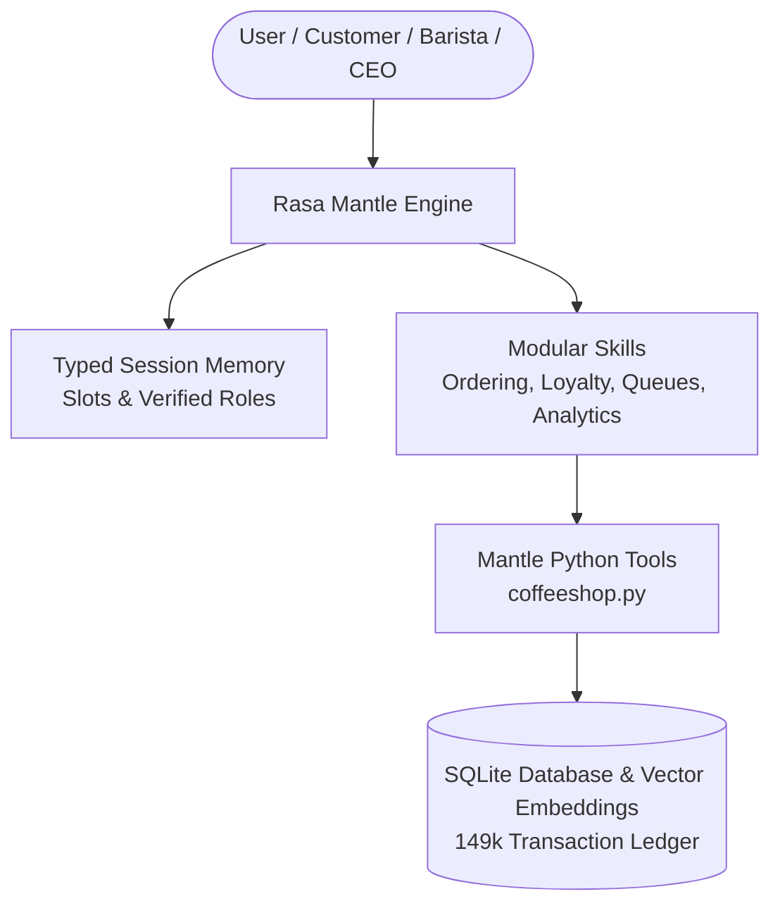

# Artisan Roast — Reference Architecture for Rasa Mantle

```text
Author:        Samrudha Kelkar
Wave:          wave-01-mantle
Assessed on:   2026-09-11
Verified with: rasa-pro 3.20.0.dev9, Python 3.12, uv
```

> **Overview for Rasa Practitioners & Architects:**  
> This project is an enterprise reference implementation demonstrating how to build a production-grade conversational assistant using **Rasa Mantle**. It highlights how Mantle's **Five Levels of Progressive Control**, **Typed Session Memory**, and **Declarative Tool Constraints** orchestrate complex multi-persona workflows with deterministic reliability.

---

## 1. What is this Project?

* **Project Name**: Artisan Roast Coffee Co. Agent (`samrudh-coffee-shop`)
* **What it Does**: A multi-persona conversational assistant for Artisan Roast Coffee Co. It handles customer drink and bakery ordering, loyalty tier rewards, barista store order queue management, sommelier sensory recommendations, store inventory oversight, and executive CEO financial analytics.

---

## 2. Broad Architecture

The assistant uses Rasa Mantle to route user requests across specialized modular skills, enforcing hard security constraints and updating typed session memory before dispatching Python tools to the backend database.



---

## 3. Core Functionalities

The assistant supports six core business capabilities designed for easy understanding across technical and non-technical stakeholders:

1. **Customer Beverage & Bakery Ordering**: Place orders for store pickup at Lower Manhattan (#5), Astoria (#3), or Hell's Kitchen (#8). Unspecified options default automatically (Regular size, Whole Milk) to complete orders efficiently.
2. **Coffee Sommelier Recommendations**: Suggest drinks matched to customer mood using 384-dimensional sensory vector similarity search.
3. **Customer Loyalty Rewards**: Inspect customer points balances, check tier status (Regular, Silver, Gold), and redeem complimentary beverages.
4. **Barista Order Queue Fulfillment**: Baristas view store order queues, verify drink recipe modifications, and update prep status (`brewing`, `ready_for_pickup`).
5. **Store Inventory Oversight**: Monitor bean, dairy, and pastry stock levels; map colloquial search terms (`"coffee beans"` -> `"Beans"`) and escalate supply outages when stock is depleted.
6. **CEO Executive Financial Intelligence**: PIN-protected executive analytics unlocking total revenue, store performance benchmarks, and gross margin metrics.

---

## 4. What Mantle Components Enable What Features?

| Business Feature | Rasa Mantle Component | How It Works |
| :--- | :--- | :--- |
| **Coffee FAQ & Sommelier Search** | Natural Language & References (`references/`) | Autonomous RAG search over domain guides using local vector embeddings (`sentence-transformers/all-MiniLM-L6-v2`). |
| **Loyalty Tier Customizations** | Scoped Instructions (`if:` blocks) | Dynamically injects Gold/Silver tier instructions only when session memory matches predicates. |
| **Barista Order Queue Fulfillment** | Ordered Blocks (`:::ordered_block`) | Enforces deterministic multi-step recipe verification and status update workflows. |
| **Inventory Restocking & Escalation** | Sub-Skill Composition (`@skill.<name>`) | Main inventory skill dispatches tasks to isolated, reusable sub-skills (`@skill.restock_inventory`, `@skill.escalate_supply_outage`). |
| **Customer Order Placement** | Declarative Tool Constraints | Enforces tool preconditions (`requires: session.place_customer_order.selected_item`) and confirmation gates before order creation. |
| **Skill Lifecycle Completion** | Frontmatter `complete_when` Mapping | Uses `complete_when:\n  condition: "session.<skill>.<field>"` to complete skills deterministically without extra prompt turns. |
| **CEO Financial Analytics** | Tool Context RBAC & Memory | Python decorators inspect `ToolContext.memory` to gate financial analytics behind 4-digit PIN authentication (`pin_verified`). |

---

## 5. Session Memory Architecture

Rasa Mantle uses typed memory schemas (`memory.yml`) to maintain state across turns:
* **Global Session Memory**: Tracks persistent state across skills, such as active customer ID, store location, and verified CEO authorization (`is_ceo`, `user_role`).
* **Skill Session Memory**: Scoped variables tracking current order selections, PIN attempts, and skill completion flags (`order_completed`, `pin_verified`).

---

## 6. Multi-Turn Evaluation Suite (`evals/`)

This project includes an autonomous multi-turn evaluation suite equipped with an interactive Web UI for real-time visualization and navigation. Powered by a cross-functional model family (OpenRouter DeepSeek V3, OpenAI, Gemini), the suite uses an automated LLM judge to simulate multi-turn user dialogues, interact with the Rasa server, evaluate agent responses, and inspect Rasa's intermediate tracker logs to monitor internal stack execution at every turn. It provides complete observability over LLM compute API call quotas and turn efficiency. Using this harness, we conducted a benchmark across five operational tasks (3 simulation runs per task) and improved the assistant's overall task completion accuracy from **46% to 80%**. This performance gain was achieved by upgrading the Rasa Pro engine, adopting native `complete_when` skill completion mappings, and refactoring skill instructions to resolve multi-turn ordering bottlenecks.

---

## 7. Repository Layout

```text
coffee-shop/
├── agent.yml                  # Root agent persona, system instructions, and settings
├── memory.yml                 # Typed session memory schema
├── pyproject.toml             # Dependencies (rasa-pro 3.20.0.dev9)
├── Makefile                   # Training and testing commands
├── tools/
│   └── coffeeshop.py          # 16 Mantle tools with RBAC security
├── skills/                    # 12 Modular skills
│   ├── place_customer_order/  # Ordering with single-turn combinations & complete_when
│   ├── verify_ceo_authentication/# Executive PIN authentication flow
│   ├── query_executive_analytics/# RBAC-gated financial intelligence
│   ├── manage_store_inventory/# Store inventory tracking
│   ├── process_store_orders/  # Barista queue fulfillment ordered block
│   ├── recommend_coffee_sommelier/# 384D sensory vector recommendations
│   └── browse_coffee_menu/    # Menu search
└── evals/                     # Multi-turn evaluation suite & interactive dashboard
    ├── README.md              # Evaluation guide & benchmark report
    ├── eval_simulator.py      # CLI simulator script
    ├── server.py              # Standalone HTTP server for Web UI dashboard
    ├── web/index.html         # Interactive dashboard frontend
    └── eval_results/          # Benchmark report markdown
        └── BENCHMARK_REPORT.md
```

---

## 8. How to Run

```bash
# 1. Install dependencies
uv sync

# 2. Train the agent
make train

# 3. Start the Rasa agent server (Terminal 1 - runs in foreground)
make run

# 4. (Optional) Run the evaluation suite & Web UI dashboard (Terminal 2 - open a separate terminal tab/window)
cd evals && python3 server.py
```

---

## 9. Data Sources & Acknowledgments

* **Coffee Sales & Transaction Ledger**: Executive financial analytics and store transaction metrics are built upon and extended from the [Kaggle Coffee Sales Dataset](https://www.kaggle.com/datasets/ahmedabbas757/coffee-sales) by Ahmed Abbas.

